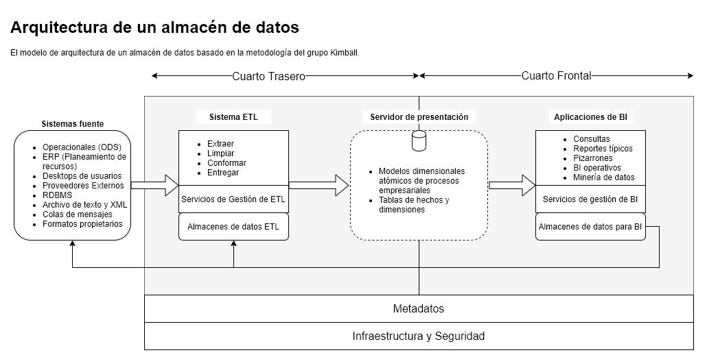

```{r settings}
knitr::knit_hooks$set(inline = identity) 
```

Ver la lista completa de tareas para un proyecto de *data warehousing* en *docs_apoyo/PRJ_tasklist_Kimball.xls*.

# Alcance {#scope}
\index{A!Alcance}

## Contexto {#background}
\index{C!Contexto}

Breve descripción de la empresa institución.

Qué desea lograr la empresa/institución con este proyecto. Describir de manera gruesa las métricas de éxito en general, tanto métricas como categóricas.

## Alcance del proyecto {#projectscope}
\index{A!Alcance}

Cubrir aspectos como:

- Delimitación temporal de la información que contendrá el DW.
- Procesos estratégicos, tácticos u operativos contemplados.
- Alcance de usuarios.
- Arquitectura técnica del proyecto.

## Elementos fuera del alcance del proyecto {#exlusionsfromscope}
\index{E!Exclusiones del alcance}\index{A!Alcance!exclusiones}

- Fuentes de datos o procesos que quedan por fuera del proyecto.
- Usuarios y soporte que queda fuera del proyecto.
- Características técnicas que quedan por fuera.

## Criterios de éxito {#successcriteria}
\index{C!Criterios de éxito}\index{A!Alcance!criterios de éxito}

- Incluir a nivel de características disponibles para el usuario (no tanto en enfoque técnico, a menos que sea necesario).

## Riesgos y Plan de reducción de riesgos {#risks}
\index{R!Riesgos}\index{R!Riesgos!plan de reducción}\index{P!Plan!de reducción de riesgos}

- Listar algunos supuestos a nivel de proyecto y mantenimiento del proyecto.
    - Por ejemplo, existencia de un TI con conocimiento en administración de bases de datos. O el mantenimiento de tareas programadas como en el *SQL Server Agent*.
- No incluir riesgos sobre el desarrollo del proyecto (eso se maneja a otro nivel, como en términos de referencia o contrato).


# Justificación {#justification}
\index{J!Justificación}

**Negocios**: Crear un caso de negocios, tomar en cuenta los beneficios tangibles e intangibles. Construir índices financieros como el ROI, al determinar los costos del proyecto y las entradas.

Costos:

- Hardware.
- Software.
- Personal interno.
- Personal/Recursos externo.
- Costos de mantenimiento/soporte.
- Costos para apoyar el escalamiento del proyecto.


# Requisitos {#requisitos}
\index{R!Requisitos}

Los requisitos se deben presentar en dos niveles: a nivel de programa y a nivel de proyecto. El nivel de programa presenta los requisitos de la empresa, institución u organización. El nivel de proyecto, presenta los requisitos a nivel de proceso [@Kimball2008, capítulo 3]. 

Esta sección debe estar organizada en:

- Resumen ejecutivo.
- Resumen sobre cómo se definieron los requerimientos, la metodología y participantes.
- *Data Warehouse bus Matrix* en un nivel alto.
- Criteros preliminares de éxito.
- Requerimientos del negocio, separados por procesos.
    - Descripción narrativa de los requerimientos, de las métricas generadas por el proceso. Además, describir los principales obstáculos actuales y potenciales.
    - Preguntas típicas que podrían ser respondidas vía una mayor disponibilidad y acceso a los datos.
    - Evaluación inicial sobre la factibilidad de los datos.
    
Material de @Kimball2008:

- Invitación a sesión de requerimientos en *docs_apoyo/REQ-Interview-Letter.doc*.
- Agenda para la sesión de inicio de proyecto en *docs_apoyo/REQ-User-Kickoff-Agenda.doc*.
- Cuestionario sobre requerimientos en *docs_apoyo/REQ-Iterview-Questionnaire.doc*.
- Basic/Detailed Bus Matrix *docs_apoyo/Matrix Bus.ods*


# Roles {#roles}
\index{R!Roles}

Los roles (funciones) del proyecto. Asignar los roles a "personas" (no a personas físicas, pero a puestos dentro de la empresa). Por ejemplo: el jefe del departamento de informática (*persona*) es el encargado de administrar la base de datos, director del programa del almacén de datos, y el gestor de seguridad (*roles*)


# Plan de comunicación {#plandecomunicacion}
\index{C!Comunicación!Plan de}\index{P!Plan!de comunicaciones}


# Seguimiento de problemas y control de cambios {#seguimientodeproblemasycontroldecambios}
\index{P!Problemas!seguimiento de}\index{B!Bugs}\index{I!Issues}\index{C!Control de versión}\index{V!Versión!control de}

Indicar los sitios para controlar la calidad y la versión del producto. Indicar usuarios y la ubicación de contraseñas.


# Arquitectura {#arquitectura}
\index{A!arquitectura}

La arquitectura describe el *cómo se hará*; para eso es necesario saber *qué se hará*, cuya respuesta es dada por los requisitos. La arquitectura debe separarse en 3 partes: arquitectura de la aplicación, infraestructura y arquitectura de datos.


{width=100%}
\FloatBarrier

## Plan de arquitectura {#plandearquitectura}
\index{P!Plan de arquitectura}\index{A!Arquitectura!Plan de}

El plan de arquitectura de tener una estructura similar al siguiente modelo:

## Resumen Ejecutivo {#arqresumenejecutivo}

### Entendimiento del negocio {#arqentendimientodelnegocio}

### Enfoque del Proyecto {arqenfoquedelproyecto}

## Metodología {#arqmetodologia}

### Requerimientos de negocio {#arqrequerimientosdelnegocio}
(elaborado a partir del documento de implicaciones arquitectónicas)

### Desarrollo arquitectónico {#arqdesarrolloarquitectonico}
(alto nivel)

### Productos y normas existentes {#arqproductosynormasexistentes}

### Mejoras en proceso {#arqmejorasenproceso}


## Requerimientos e implicaciones arquitectónicas {#requerimientoseimplicaciones}
Detallar por proceso (usar el documento de implicaciones arquitectónicas)

- Incluir problemas comunes:
- Calidad de datos.
- Elementos comunes, y definiciones del negocio.

## Resumen Arquitectónico {#resumenarquitectonico}

### Modelo de nivel alto

### Metadatos

### Capas flexibles de servicios
(tareas como creación de tablas recuperación de datos, flujo de datos).


## Elementos arquitectónicos principales {#arqelementosarquitectonicosprincipales}

### Funciones y servicios

#### Servicios de ETL

#### Servicios de acceso a datos externos

#### Mantenimiento de datos

### Ubicación de datos

#### Fuentes de datos, y datos de referencia

#### *ETL Data Stagging*

#### Servidores de presentación

#### Repositorios de metadatos

### Infraestructura y utilidades

### Estrategia de metadatos


## Proceso de desarrollo de arquitectura {#procesodedesarrollo}

### Fases del desarrollo arquitectónico

### Pruebas de concepto

### Selección de productos y normas

### Matriz Bus de alto nivel para el negocio

## Estrategia de metadatos {#estrategiademetadatos}

## Inventario de metadatos {#inventariodemetadatos}

## Herramientas de captura y sincronización de metadatos {#herramientasdecaptura}

## Políticas de seguridad y sensibilidad de datos {#politicasdeseguridad}

## Sistema de monitoreo y cumplimiento de seguridad {#sistemademonitoreo}

## Mapa de Infraestructura {#mapadeinfraestructura}

## Apéndices: Modelos arquitectónicos {-}

## Apéndices: Resumen de entrevistas sobre requerimientos arquitectónicos {-}

Material de apoyo @Kimball2008:

- Tabla de contenidos del Plan Arquitectónico: *docs_apoyo/ARQ-ToC.doc*.
- Hoja electrónica para selección de productos ETL en: *docs_apoyo/ARQ-Seleccion_Productos.ods* (ESP).
- ERD con tablas para contener metadatos del almacén: *docs_apoyo/ARQ-Metadata diagram.ppt*.
- SQL para construir las tablas de metadatos en *docs_apoyo/Metadata diagram.sql*.
    

# Modelo Dimensional {#modelodimensional}
\index{M!Modelo dimensional}

Esta sección presenta el modelo teórico (independiente de la plataforma final RDBMS) del almacén de datos. Se calcula de 3-4 semanas por tabla de hechos, dependiendo de la complejidad y número de dimensiones. Revisar los capitulos 6 y 7 de  @Kimball2008. Los principales productos son:

- Descripción breve del proceso de negocio incluído en el diseño.
- Discusión en nivel alto sobre los requerimientos que serán soportados, referenciando al documento detallado de requerimientos.
- Diagrama del modelo a nivel alto (dimensiones y hechos)(ver *DIM-High level model diagram.ppt*.
- Lista de atributos y métricas.
- Hoja detallada del diseño dimensional (*DIM-Example-Data-Model-Information.xls*).
- Lista de problemas (*issues*).
- Discusión de limitaciones del diseño con respecto al alcance del proyecto y requerimientos del negoció.
- Otros puntos como compromisos de diseño, preocupaciones sobre la fuente de datos, etc.
- Esquema inicial de mapeo de datos desde la fuente al objetivo.


# Diseño físico y desempeño {#diseñofisicoydesempeño}
\index{D!Diseño físico de la base de datos}\index{D!Desempeño del almacén}

Para referencia revisar capítulo 8 de @Kimball2008 y el documento de apoyo  *docs_apoyo/PHY-Physical-Model-Template.xls*. Los principales productos son:

- Estándares: Desarrollar un vocabulario y procedimientos normalizados de uso general en el almacén
  - Vocabulario y convenciones para nombrar.
  - Uso o no uso de valores nulos.
  - Ubicación y seguridad de *stagging tables*.
  - Normalización para la ubicación de archivos.
  - Uso de sinónimos, vistas, procedimientos almacenados, esquemas, etc. para acceder a tablas según los usuarios.
  - Claves primarias.
  - Claves secundarias.
- Modelo físico: traducir el modelo dimensional a tablas dentro del RDBMS.
  - Finalizar el mapeo detallado de datos desde la fuente hasta las tablas físicas.
  - Consolidar el diseño en *Star* o *Snowflake*.
  - Usar herramientas de modelado si es posible.
  - Desarrollar estimados iniciales del tamaño.
- Construir la base de datos en ambiente de desarrollo.
- Diseñar bodegas para procesamiento de datos.
  - Considerar tablas especiales y esquemas especiales como: *stagging tables* para ETL; Tablas y campos para auditorías; tablas para el monitoreo del uso de la base de datos; tablas de seguridad.
- Desarrollar el plan de indexado:
  - Investigar las optimizaciones que ofrece el RDBMS para almacenes de datos.
  - *B-Tree y clustered indexes*: Columnas con alta cardinalidad (muchas categorías, o variables contínuas).
  - *Bitmap indexes*: Para baja cardinalidad.
  - [*Columnstore clustered indexes*](https://docs.microsoft.com/en-us/sql/relational-databases/indexes/columnstore-indexes-design-guidance?view=sql-server-ver15): Especial para fact tables.
  - Mantenimiento y reconstrucción de índices después de una carga de datos.
  - Indexar todos los campos y atributos de las tablas dimensionales comunes en consultas.
- Diseñar la base de datos OLAP.
- Construir la base de datos de prueba (lo más similar en hardware y arquitectura a la de producción, ojalá con datos reales).
- Diseñar las agregaciones.
  - Materialized Views (Oracle, PostgreSQL).
  - Indexed Views (SQL Server).
  - Investigar si las agregaciones son utilizadas por en el *query plan* del RDBMS.
  - Investigar cómo mantener la agregación después de cargar los datos.
  - Probar el desempeño de los índices y consolidar el plan de indexado.
- Diseñar y construir la instancia de la base de datos real.
  - Considerar la memoria de acuerdo con las consultas hechas a la base de datos.
  - *Block size*: Preferir bloques grandes, especialmente si los índices son cargados de manera consecutiva (*identity, sequence*). Preferir bloques pequeños si los índices están muy fragmentados, y los patrones de acceso son impredecibles (ejemplo claves basadas en GUID).
  - Guardar y controlar la versión de los scripts para crear la base de datos.
- Desarrollar la estructura física de almacenamiento.
  - Incluye la estructura de bloques, archivos, discos, particiones, espacios de tablas y bases de datos.
  - Desarrollar el plan de particiones:
    - Considerar dimensiones y hechos de uso común, y separarlas en discos diferentes de ser posible usando *filegroups* (SQL Server). Esto incrementa la velocidad del I/O en las consultas.
    - Separar grandes tablas de hechos en particiones de acuerdo con la fecha de los eventos registrados.
    - Considerar hacer particiones cuando las tablas de hechos sean mayores a \SI{100}{\gibi\byte}.
  - Considerar un almacenamiento de 3 a 4 veces superior al calculado según el modelo dimensional (para logs, tablas auditadas, monitoreo de usuarios, etc.)
  - Tolerancia a fallos:
    - Usar RAID5 o superior: Este es un sistema que refleja los datos de un disco en otro (o varios) discos de respaldo.


# (APPENDIX) Anexo {-}

# Anexo I

Este es el anexo 1


\begingroup
\small
\printindex
\vfill
\endgroup


# Bibliografía {-}


\setlength{\parindent}{-0.2in}
\setlength{\leftskip}{0.2in}
\setlength{\parskip}{8pt}
\noindent
